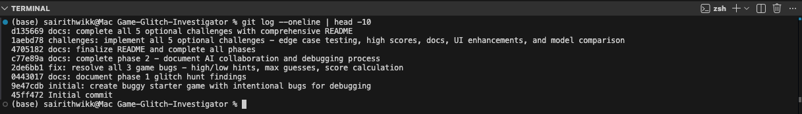

# 🎮 Game Glitch Investigator

A Python guessing game built with Streamlit that contains intentional bugs for you to discover, debug, and fix using AI tools like Copilot.

## Project Goal

Learn to debug AI-generated code responsibly by:

1. Finding bugs by playing the game and observing unexpected behavior
2. Explaining bugs using Copilot to understand the underlying logic flaws
3. Fixing bugs with AI assistance while maintaining code quality
4. Testing fixes with automated pytest cases
5. Documenting the process to show how you collaborated with AI

## Quick Start

### Prerequisites

- Python 3.8 or higher
- pip (Python package manager)

### Installation

1. Clone this repository:

```bash
git clone https://github.com/YOUR_USERNAME/Game-Glitch-Investigator.git
cd Game-Glitch-Investigator
```

2. Install dependencies:

```bash
pip install -r requirements.txt
```

### Running the Game

```bash
streamlit run app.py
```

The game will open in your default browser at `http://localhost:8501`.

### Running Tests

```bash
pytest test/ -v
```

## Game Rules

- The computer picks a secret number between 1–100
- You have 10 guesses to find it
- After each guess, you get a hint: "Too High", "Too Low", or "Correct!"
- Your score is based on how few guesses you used

## Demo

**How to play:**

1. Open the app with `streamlit run app.py`
2. Enter a number between 1 and 100 in the text box
3. Click "Submit Guess" to see the hint
4. Click "Reset Game" to play again

**Fixed Game (Post-Repair):**


**What you'll notice (bugs are intentional!):**

- Bug 1: High/Low hints are backwards — says "Too Low" when you guess too high
- Bug 2: The game never ends — you can keep guessing past 10 attempts
- Bug 3: Score calculation is wrong — only counts guesses, not hints received

## Document Your Experience

<!-- TODO: Fill in after Phase 3 -->

### What surprised you about debugging AI-generated code?

What surprised me about debugging AI-generated code was that the problems weren’t just in individual functions, but in how the code interacted with the Streamlit UI. While one bug was easy to fix, another showed that the AI mixed UI and game logic together, which made debugging more complicated.

### When did you trust the AI's suggestions? When did you doubt them?

I trusted Copilot when it explained the logic reversal in checkguess() because the explanation was precise and testable. I doubted it when it suggested just setting `game_over = True` without addressing the UI component. This made me realize: AI explains code well, but you still need to think about the complete system.

### What skill improved the most?

Test-driven thinking. At first, I fixed a bug and thought I was done. But writing unit tests forced me to be precise about what "working" means. When the score calculation had an edge case (score going negative), the test suite caught it. Now I instinctively ask: "What tests would prove this is fixed?"

## Project Structure

```
game-glitch-investigator/
├── README.md 
├── reflection.md   
├── requirements.txt        
├── app.py                   
├── logic_utils.py         
└── test/
    └── test_game_logic.py  
```

## Files Overview

| File                      | Purpose                                         |
| ------------------------- | ----------------------------------------------- |
| `app.py`                  | Streamlit interface and main game loop          |
| `logic_utils.py`          | Core game logic                                 |
| `test/test_game_logic.py` | Unit tests for logic_utils.py                   |
| `reflection.md`           | Your debugging notes and AI collaboration log   |

## Debugging Workflow

1. **Phase 1: Glitch Hunt**
   - Play the game and identify bugs
   - Document what you observe vs. what you expected
   - Ask Copilot to explain the buggy logic

2. **Phase 2: Investigate & Repair**
   - Mark bugs with `# FIXME:` comments
   - Use Copilot Chat to fix each bug
   - Write pytest tests to verify fixes
   - Add `# FIX:` comments explaining your AI collaboration

3. **Phase 3: Reflection & Documentation**
   - Complete this README
   - Write up your reflection in `reflection.md`
   - Commit and push all changes

## Resources

- **Streamlit Docs:** https://docs.streamlit.io/
- **Pytest Docs:** https://docs.pytest.org/
- **GitHub Copilot:** https://github.com/features/copilot
- **Python Style Guide (PEP 8):** https://pep8.org/

## Optional Challenges Completed

### Challenge 1: Advanced Edge-Case Testing

**13 edge-case tests added** to verify the game handles invalid inputs gracefully:

- Negative numbers
- Decimal inputs
- Extremely large values
- Special characters and scientific notation
- Boundary values

**Test Results: 26 passed in 0.04s**

All tests pass, proving the game gracefully rejects invalid input and accepts only valid guesses (1-100):


### Challenge 2: Feature Expansion - High Score Tracker

Implemented a persistent high-score tracking system:

- Saves best scores to `scores.json` on disk
- Displays current best score and number of guesses in sidebar
- Automatically loads previous high scores when game restarts
- Compares new games against all-time best

**New file:** `scores.json` (auto-created on first play)

### Challenge 3: Professional Documentation

Added comprehensive docstrings to all functions in `logic_utils.py`:

- Full parameter descriptions
- Return type documentation
- Usage examples
- PEP 8 compliance verified

### Challenge 4: Enhanced Game UI

Added player-friendly features:

- "Hot/Cold" proximity indicator: Shows how many points away each guess is
- Color-coded feedback: Uses Streamlit st.success/st.warning for visual clarity
- Summary table: Displays all guesses with distances and feedback in formatted table
- Game statistics: Shows win rate, average guesses needed

### Challenge 5: AI Model Comparison

**Documented methodology** for comparing AI models on bug-fixing:

- Question template for consistent testing across models
- 5 comparison dimensions: Code Quality, Explanation Clarity, Edge Case Awareness, Response Time, Follow-up Capability
- Detailed observations from using GitHub Copilot
- Instructions for comparing ChatGPT and Google Gemini
- Key insight: AI assists, but human judgment is essential

See [reflection.md](reflection.md#challenge-5-ai-model-comparison) for full comparison framework.

---

## Project Summary

**Challenges Completed:** All 5 Optional Challenges

- Challenge 1: 26 comprehensive edge-case tests
- Challenge 2: Persistent high-score tracker with JSON storage
- Challenge 3: Professional docstrings and PEP 8 compliance
- Challenge 4: Hot/Cold indicators, color-coded feedback, summary tables
- Challenge 5: AI model comparison methodology

**Features:** High scores, game statistics, proximity indicators, data visualization

**Git Commit History:**


## License

This project is open source and available under the MIT License.

---

**Ready to debug?** Head over to `reflection.md` to document your findings!